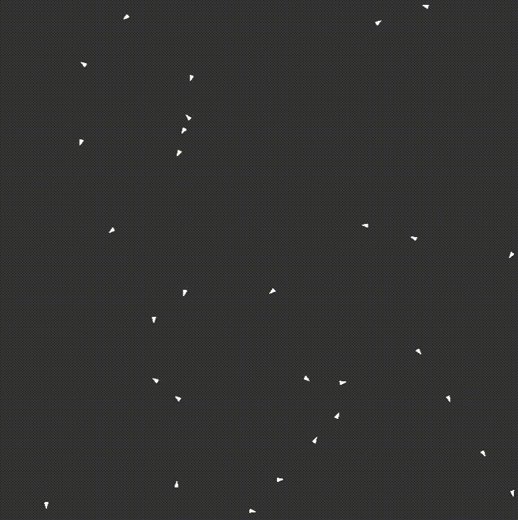

# boids

A simple python implementation of the [boids algorithm](https://www.red3d.com/cwr/boids/).

## Output

## Installation

Requires python 3 and the p5 python implementation. See [here](https://p5.readthedocs.io/en/latest/install.html).
